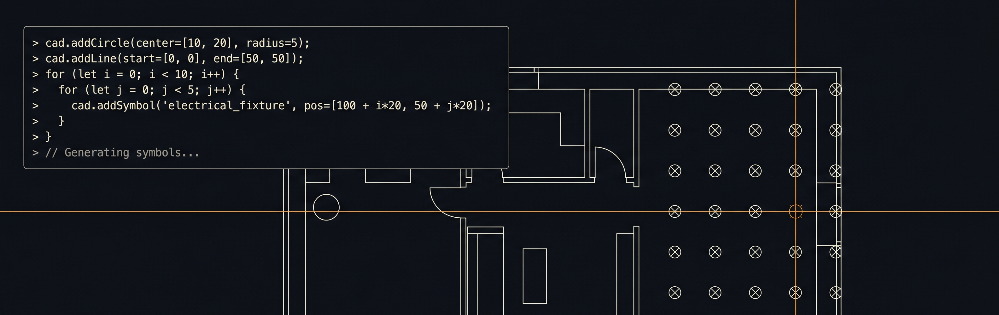

<p align="center" style="font-size:2em;font-weight:bold">CodeCAD</p>

Open-source 2D CAD you can actually program. Runs in the browser, reads
.dwg files, and every drawing operation is a function call. Write a script
that draws for you, point an AI agent at it, or collaborate live across
multiple browsers.

<p align="center">
  
</p>

**[Try it in your browser](https://backkem.github.io/codecad/app/)** -- no install needed.

Built in Rust and WASM. No license server, no vendor lock-in. You own the
tool and the data.

## Features

**Browser-only (WASM)** -- works as a static site, no backend required:

- **DWG viewer**: opens .dwg files (R13-R2018) with infinite vector zoom.
  Dual renderer: Vello (GPU compute, WebGPU) with egui CPU fallback.
- **Multi-document tabs**: several drawings side-by-side, each with
  isolated camera, layers, and undo history.
- **Scriptable**: every drawing operation is a `cad_call(method, args_json)`
  you can drive from the browser console or your own code.

**With server** -- run `cadview-server` for persistence, sync, and automation:

- **Real-time sync**: edits propagate instantly to all connected browsers
  via Yrs CRDT over WebTransport.
- **Server-side scripting**: JS in a Wasmtime WASM sandbox with direct
  document access. Mutations batch and broadcast to all viewers.
- **HTTP API**: `POST /api/run` to execute scripts from curl, CI, or MCP.

## Quick start

Prerequisites: Rust nightly, `wasm-bindgen-cli`, Node.js + pnpm,
[just](https://github.com/casey/just).

```bash
just build   # WASM + frontend + server

# Serve a DWG
RUST_LOG=info cargo run -p cadview-server --release -- path/to/file.dwg

# Or a folder of DWGs
RUST_LOG=info cargo run -p cadview-server --release -- --dir ./drawings/
```

Opens at http://localhost:8765. Drag-and-drop .dwg files onto the page.

## Architecture

Four Rust crates, one TypeScript + React frontend:

| Crate | Role |
|-------|------|
| `cadview-core` | Document model, DWG parsing, `cad_call` dispatcher, Yrs CRDT sync. Compiles for wasm32 and native. Zero global state. |
| `cadview-web` | WASM browser target: session registry, dual renderer (Vello + egui), wasm-bindgen exports. |
| `cadview-server` | HTTP (axum) + WebTransport (wtransport). Document store, lazy loading, per-doc broadcast, script sandbox. |
| `cadview-sandbox` | Wasmtime WASM component sandbox for server-side JS execution. |

See [docs/architecture.md](docs/architecture.md) for the full design and
[AGENTS.md](AGENTS.md) for contributor/agent orientation.

## Docs

- [API surface](docs/api-surface.md) -- full JS API, block system, worked exercises
- [Drawing skill](SKILL.md) -- techniques, patterns, fillet/offset rules
- [Contributing](CONTRIBUTING.md) -- build, test, code style

## License

[MIT](LICENSE)
