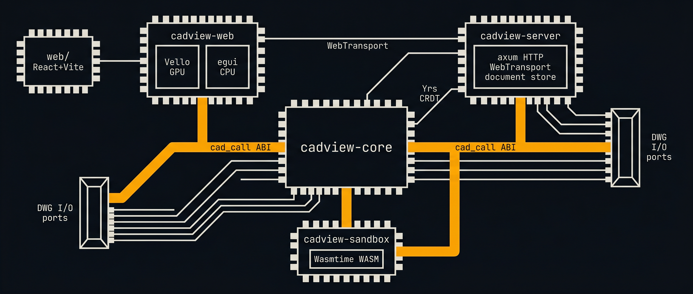

# CodeCAD architecture

<p align="center">
  
</p>

Browser-based CAD viewer and editor for .dwg drawings with a Rust
server backend. Reads DWG via acadrust, dual GPU renderer (Vello
compute-based + egui fallback), syncs bidirectionally between server
and browser(s) via Yrs CRDT over WebTransport. Multi-document tabs
with per-session isolation.

## Why this exists

.dwg floor plans are everywhere, but viewing and editing them still requires
heavyweight desktop software. We want to:

1. View them in a browser with infinite zoom (no rasterization)
2. Open multiple drawings side-by-side in tabs
3. Overlay electrical/plumbing/network plans
4. Edit via conversation with an AI agent, see changes in real time
5. Edit from multiple browser tabs or from server-side automation
6. Drag-and-drop new DWG files to view instantly

## Stack

```
 Browser (Chrome, WebGPU)                    Server (cadview-server)
 ┌──────────────────────────┐               ┌──────────────────────────┐
 │ React UI                 │   QUIC/TLS    │ axum (HTTP)              │
 │  TabBar + DocPicker      │◄════════════►│  GET /api/documents      │
 │  ViewportContainer(s)    │ WebTransport  │  serves dist/            │
 │                          │               │  bearer token auth       │
 │ SessionRegistry          │  per-doc      │                          │
 │  N sessions in memory    │  sync streams │ DocumentStore            │
 │  M visible (rendered)    │               │  SingleFileStore         │
 │  1 js_target for API     │               │  FolderStore             │
 │                          │               │                          │
 │ Per session:             │  per-doc      │ DocumentRegistry         │
 │  Document (cadview-core) │  Yrs sync     │  lazy load from store    │
 │  SyncDoc (Yrs peer)      │               │  auto-create empty slots │
 │  Camera + RenderCache    │               │                          │
 │  Vello/egui renderer     │  RPC          │ Per document:            │
 │  hidden layers           │  streams      │  Document + SyncDoc      │
 │                          │               │  broadcast channel       │
 │ cad.ts typed API         │               │  client count            │
 └──────────────────────────┘               │                          │
                                            │ Sandbox (Wasmtime)       │
  curl / MCP / cad.exec()                   │  JS via custom WIT       │
  POST /api/run ───────────────────────────►│  cad-call, read-file     │
                                            │  batch -> Yrs broadcast  │
                                            └──────────────────────────┘
```

## Multi-document model

### Three-tier session state

| Tier | Meaning | Count |
|------|---------|-------|
| Open | In memory, syncing via Yrs over WebTransport | N (all open sessions) |
| Visible | Has a `<canvas>` + eframe WebRunner rendering it | M (currently 1, future: split view) |
| JS target | Which session `cad.*` calls operate on | 1 (set by `cad.useSession()`) |

### Document lifecycle

1. **Server-loaded**: CLI arg or folder scan, pre-loaded into registry
2. **Browser-opened**: user clicks in DocumentPicker, `cad.sessions.create(id)` opens sync stream, server lazy-loads from store
3. **Drag-and-drop**: user drops .dwg file, parsed in WASM via `session_load_dwg`, synced to server (auto-creates empty slot, Yrs pushes content)
4. **New drawing**: empty session created, synced to server, user draws via `cad.*` API

### Session isolation

Each `DocumentSession` (WASM side) bundles:
- `Document` (entity list, layers, blocks, undo/redo)
- `SyncDoc` (Yrs peer with entity/layer/block YMaps)
- `Camera` (center, zoom, initialized flag)
- `RenderCache` (egui path: tessellated fills, arcs, curves)
- `hidden_layers` (per-session layer visibility)
- `screen_size` (for zoomTo calculations)

No shared mutable state between sessions. `cadview-core` has zero
global state, so N documents run in parallel without interference.

### Document store

S3-like flat key space. Keys are slash-separated paths
(e.g. `sub/floor-plan.dwg`). UI groups by prefix as virtual folders.

| Implementation | CLI usage | Behavior |
|---------------|-----------|----------|
| `SingleFileStore` | `cadview-server file.dwg` | One key, pre-loaded |
| `FolderStore` | `cadview-server --dir ./drawings/` | Recursive scan, lazy load |
| `FolderStore` | `cadview-server` (no args) | Scans cwd |

`DocumentRegistry` wraps the store. `get_or_load(key)` lazy-loads
from the store on first access. Unknown keys (new client drawings)
get empty slots created automatically.

## Crate layout

```
Cargo.toml                    # workspace (core, web, server)
crates/
    cadview-core/             # pure Rust, platform-independent
      src/lib.rs              # Document, DWG loading, cad_call, bincode serde
      src/sync.rs             # Yrs CRDT sync (SyncDoc)
      src/geo.rs              # geometry helpers
      src/text.rs             # skrifa glyph outlines -> polylines
    cadview-web/              # wasm-bindgen target (browser renderer)
      src/main.rs             # SessionRegistry, egui renderer, wasm-bindgen exports
      src/vello_render.rs     # Vello GPU renderer, demand-driven rAF, input, BezPath cache
    cadview-server/           # native Rust server
      src/main.rs             # HTTP + WebTransport entry point
      src/store.rs            # DocumentStore trait, SingleFileStore, FolderStore
      src/registry.rs         # DocumentRegistry, lazy load, per-doc broadcast
      src/http.rs             # axum: dist/, /api/documents, auth middleware
      src/transport.rs        # WebTransport: stream classification, sync, RPC
  web/                        # frontend (TypeScript + React + Vite)
    src/cad.ts                # cad.* API, session mgmt, per-session sync
    src/App.tsx               # tabs, viewports, layers, drag-drop
    src/TabBar.tsx            # tab strip
    src/DocumentPicker.tsx    # file list + folder grouping + new drawing
    src/ViewportContainer.tsx # per-session canvas + eframe lifecycle
    src/LayerPanel.tsx        # layer visibility toggles
  dist/                       # build output
```

## DWG parsing

acadrust reads DWG R13-R2018. Entity coverage (model space 99.8%,
block defs 90.5%):

| Type        | Count | kurbo mapping                        |
|-------------|------:|--------------------------------------|
| Line        | 4,262 | `kurbo::Line`                        |
| Hatch       | 457   | boundary paths -> Lines/Arcs/Polylines |
| Arc         | 273   | `kurbo::Arc` -> `BezPath`            |
| Insert      | 169   | affine transform + block flatten     |
| MText/Text  | 154   | skrifa glyph outlines -> polylines   |
| Dimension   | 105   | anonymous block (`*D*`) expansion    |
| Spline      | 71    | De Boor NURBS evaluation -> polyline |
| LwPolyline  | 33    | bulge-to-arc tessellation -> polyline|
| Circle      | 6     | `kurbo::Circle`                      |
| Ellipse     | 1     | parametric tessellation -> polyline  |

## Sync protocol

### Stream classification

Each bidi stream on a WebTransport connection is classified by its
first message:

| First message | Type | Behavior |
|--------------|------|----------|
| JSON with `method` field | RPC | One-shot request/response, `doc_id` field routes to document |
| JSON with `{type:"document", id}` | Sync header | Long-lived Yrs sync for the named document |
| Raw binary | Legacy sync | Falls back to first loaded document |

### Per-document sync

Each document gets its own sync stream + `tokio::sync::broadcast`
channel. Multiple documents can sync simultaneously on one WT
connection. Client count tracked per slot for future LRU eviction.

### Sync handshake

1. Client sends sync header: `{type:"document", id:"floor-plan.dwg"}`
2. Client sends Yrs state vector
3. Server sends update (diff against client SV)
4. Server sends its state vector
5. Client sends its update
6. Continuous: mutations on either side produce Yrs deltas, sent over
   the sync stream. Server broadcasts to other peers on same document.

### Auth

- **HTTP**: `Authorization: Bearer <token>` on `/api/*` routes
- **WebTransport**: token injected into HTML via `window.__CADVIEW_TOKEN`
- **Default**: `CADVIEW_TOKEN` env var, falls back to `"cadview-local-dev"`

## Rendering

Dual renderer: Vello (GPU compute, default) with egui (CPU) fallback.
Both compile into the same WASM binary. JS host auto-detects WebGPU
at startup, override with `?renderer=egui` or `?renderer=vello`.

### Vello renderer (vello_render.rs)

Vello renders kurbo BezPaths directly on the GPU via compute shaders.
`Shape::to_bezpath()` (cadview-core) converts every entity type to a
BezPath once, cached per entity ID. No CPU tessellation or
zoom-dependent recomputation.

Pipeline: build `vello::Scene` (fills + strokes with single
world-to-screen Affine) -> `render_to_texture` (Rgba8Unorm
intermediate) -> `TextureBlitter::copy` to surface (Bgra8Unorm on
Windows). Demand-driven: input events schedule rAF, zero frames
when idle.

### egui renderer (main.rs, CadViewApp)

eframe `WebRunner` per canvas. CPU tessellation via `RenderCache`
(arcs, curves, fills cached per entity per zoom level). Only calls
`request_repaint()` on drag/scroll/zoom, idle otherwise.

### Shared across both renderers

WASM exports `start_renderer(canvas_id, session_id, renderer_type)`.
Both read from the same `SessionRegistry` (Document, Camera, layers).
Block/text expansion is cached per renderer instance.

### Screen-space LOD (both renderers)

Per-entity, per-frame:
1. **Frustum cull**: skip entities whose world-space bbox is outside viewport
2. **Size cull**: skip entities whose screen-space diagonal < 0.5px
3. **Alpha fade**: smoothstep from 0 to full opacity between 0.5-8px
4. **Full render**: entities > 8px draw at 1px stroke, full opacity

## AI-native drawing

The `cad_call` ABI enables "talk to Claude, Claude draws." Agents
write JS drawing code, execute via browser devtools or server RPC,
changes sync to all viewers in real time.

```js
// Agent selects which drawing to work on
cad.useSession("floor-plan.dwg")

// Then draws normally
cad.addCircle([4000, 300], 25, { layer: "F_SANITAIR" })
cad.addLine(...)

// cad_call -> Document mutation -> Yrs delta -> all browsers update
```

Multi-document support means an agent can work on multiple drawings
in sequence without reloading:

```js
cad.useSession("ground-floor.dwg")
// ... add electrical layout ...

cad.useSession("first-floor.dwg")
// ... add electrical layout ...
```
