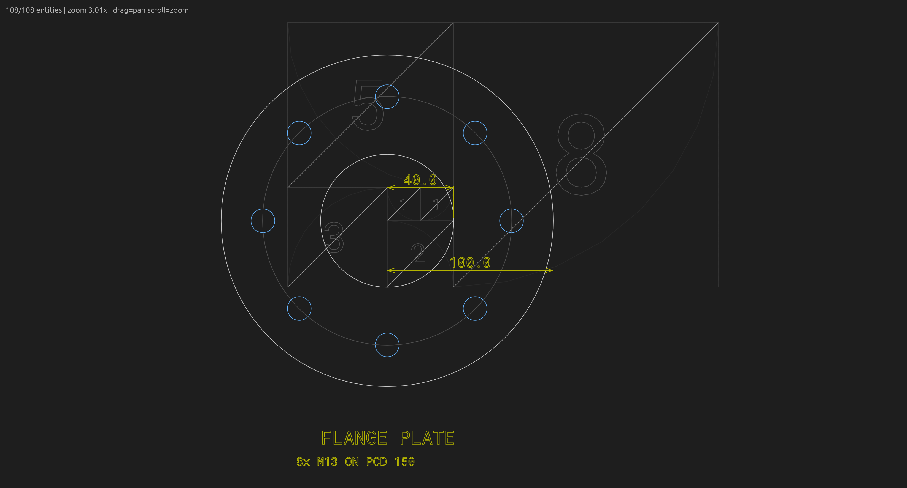
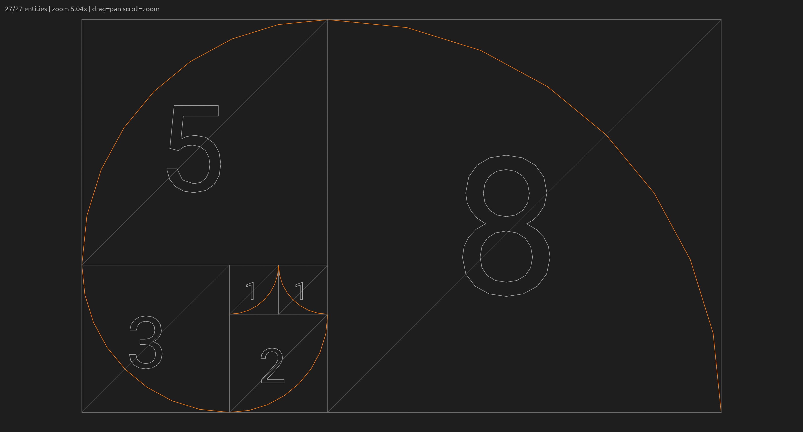
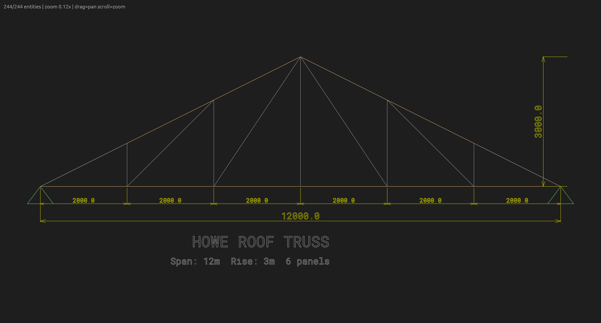
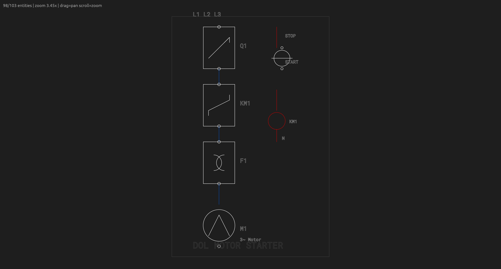
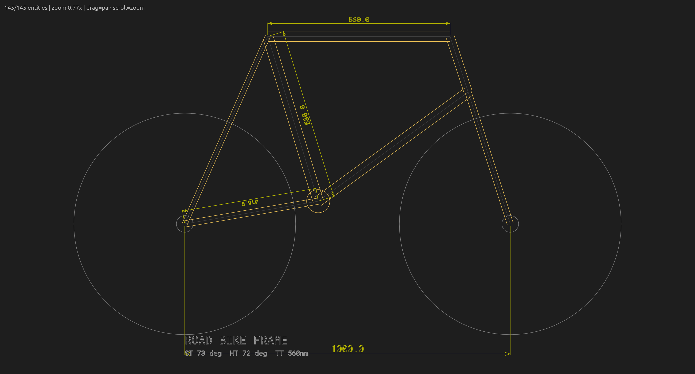
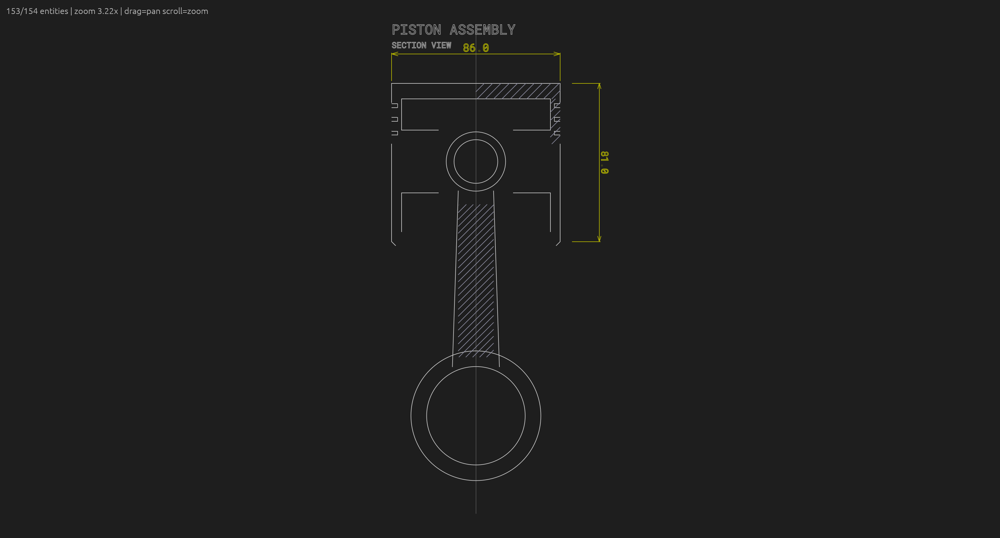

# cadview examples

Showcase drawings generated via JavaScript in the browser, synced to
the server via Yrs CRDT, and saved as DWG files. Each example
exercises a different subset of the cadview API.

All examples were single-shot generated by an AI agent (no manual
iteration on the code). The JS scripts were written once, executed
in the browser, and the result saved directly.

## 01 - Flange Plate

**Prompt:** Parametric circular pipe flange with 8 bolt holes on a PCD,
center bore, centerlines, and dimensioned radii.

**Exercises:** addCircle, addLine, measure, addText, layers, polar pattern

[JS source](01-flange-plate.js) | [DWG](01-flange-plate.dwg)

## 02 - Fibonacci Spiral

**Prompt:** Golden ratio geometric construction. Subdivide a golden
rectangle into squares, draw quarter-circle arcs through each, add
diagonal construction lines and number labels.

**Exercises:** addArc, addPolyline, addLine, addText, layers, procedural loops

[JS source](02-fibonacci-spiral.js) | [DWG](02-fibonacci-spiral.dwg)

## 03 - Howe Roof Truss

**Prompt:** Symmetric structural timber truss. 12m span, 3m rise,
6 panels. Top/bottom chords, Howe diagonal pattern, vertical web
members, support triangles, panel and span dimensions.

**Exercises:** addLine, addText, measure, layers, manual mirror symmetry

[JS source](03-roof-truss.js) | [DWG](03-roof-truss.dwg)

## 04 - DOL Motor Starter Schematic

**Prompt:** Single-line electrical schematic for a 3-phase Direct On Line
motor starter. Circuit breaker, contactor, overload relay, motor symbol.
Control circuit with start/stop buttons and contactor coil. Drawing frame.

**Exercises:** defineBlock, place, addLine, addCircle, addText, layers

[JS source](04-motor-schematic.js) | [DWG](04-motor-schematic.dwg)

## 05 - Bicycle Frame Geometry

**Prompt:** Parametric road bike diamond frame side profile. Tube
centerlines with wall-thickness offsets, wheels, bottom bracket.
Seat tube 73 deg, head tube 72 deg, top tube 560mm.

**Exercises:** addLine, addCircle, measure, addText, layers, offset tubes

[JS source](05-bicycle-frame.js) | [DWG](05-bicycle-frame.dwg)

## 06 - Piston Cross-Section

**Prompt:** Half-section view of a piston and connecting rod assembly.
Crown, ring grooves, skirt, wrist pin bore, connecting rod with big
end. Cross-hatching on cut surfaces.

**Exercises:** addLine, addCircle, addHatch, measure, addText, layers, mirror

[JS source](06-piston-section.js) | [DWG](06-piston-section.dwg)

